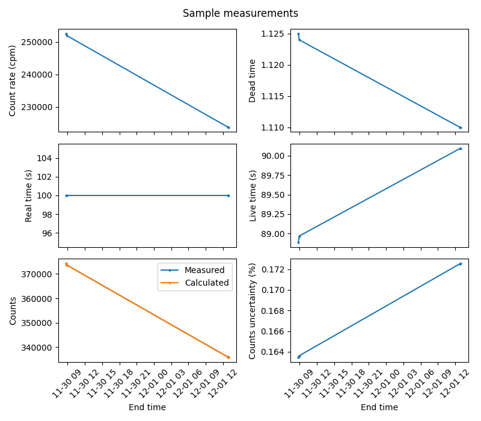
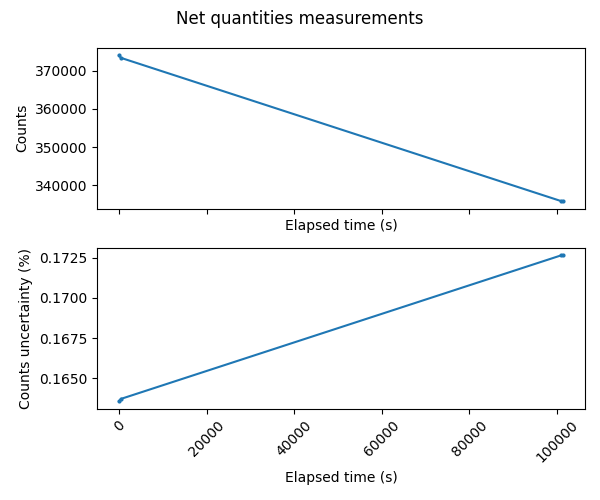

# MetPyRad

## Tools for radionuclide metrology

> **WARNING**: This package is under development. The public API should not be considered stable.


[](https://github.com/lmri-met/metpyrad)
[](https://github.com/lmri-met/metpyrad#README)
[](https://github.com/lmri-met/metpyrad/issues)
[](https://github.com/lmri-met/)

[](https://pypi.org/project/metpyrad/)
[](https://choosealicense.com/licenses/gpl-3.0/)


## Table of Contents

- [What is MetPyRad?](#what-is-metpyrad)
- [Main features of MetPyRad](#main-features)
- [How to install MetPyRad?](#installation)
- [Quick user guide](#quick-user-guide)
- [Future developments](#future-developments)
- [How to get support?](#how-to-get-support)
- [Documentation](#documentation)
- [Contributors](#contributors)
- [License](#license)
- [Contributing to MetPyRad](#contributing-to-metpyrad)

## What is MetPyRad?

**MetPyRad** is a Python package that provides a collection of tools for radionuclide metrology.
It is an open source, GPLv3-licensed library for the Python programming language.
It is compatible with Python 3.
**MetPyRad** provides tools for processing measurements for a given radionuclide using a **Hidex TDCR** (Triple to Double
Coincidence Ratio) system.
It is designed to facilitate the handling, analysis, and summarization of measurement data.

## Main features of MetPyRad

**MetPyRad** provides five main features for processing measurements for a given radionuclide using a Hidex TDCR system:

- **Data Parsing and Processing**: It includes tools to parse measurement data from CSV files,
  process different types of measurements (background, sample, net),
  and compile the results into comprehensive data structures.
- **Measurement Summarization**: It includes tools to generate detailed summaries of the measurements,
  including statistical analysis and cycle information.
- **Visualization**: It includes plotting tools to visualize various quantities of the measurements,
  such as count rates, dead times, and uncertainties, making it easier to interpret the data.
- **Exporting Results**: It includes tools to export the processed data and visualizations to CSV and PNG files,
  for further analysis or reporting.
- **Comprehensive Analysis**: It supports end-to-end analysis workflows,
  from parsing raw data to generating summaries and visualizations, and saving the results.

## How to install MetPyRad?

**MetPyRad** can be installed from the [Python Package Index (PyPI)](https://pypi.org/project/metpyrad/)
by running the following command from a terminal:

```bash
pip install metpyrad
```

## Quick user guide

Consider that we made a **measurement** of the **radionuclide** Lu-177 starting on November 2023 using a **Hidex TDCR system**.
The measurement consists on two cicles of measurements, each one with 2 repetitions.
Each repetition consists on measuring the background and the sample of Lu-177 consecutively in periods of 100 seconds.
For each cicle of measurements, Hidex TDCR system provides a **CSV file** with the readings.
An example of this CSV file is shown at the [Data files](#data-files) section

We want to **process the reading files** provided by the Hidex TDCR system.
From these files, we want to extract some quantities of interest for each background and sample measurements.
Then, whe want to compute some net quantities from the background and sample measurements.
For each **background** or **sample measurement**, we are interested in the next quantities:
cycle, sample, repetition, end time, dead time, real time, live time, elapsed time, count rate, counts and counts uncertainty.
For each corresponding **net measurement**, we are interested in the next quantities:
cycle, repetition, elapsed time, count rate, counts and counts uncertainty.

The tool that **MetPyRad** provides to do this is the **HidexTDCR** class.
Here is a step-by-step guide to using **HidexTDCR** for processing and summarizing the measurements of a given 
radionuclide using a Hidex TDCR system.

1. **Import** the `HidexTDCR` class
    ```python
    from metpyrad import Hidex300
    ```
2. **Initialize the Processor**:
   Create an instance of the `HidexTDCR` class by specifying the radionuclide, year, and month of the
   measurements:
    ```python
    processor = HidexTDCR(radionuclide='Lu-177', year=2023, month=11)
    print(processor)
    ```
   Output:
    ```
    Measurements of Lu-177 on November 2023
    ```
3. **Parse Readings**:
   Parse the readings from CSV files provided by the instrument located in a specified folder:
    ```python
    processor.parse_readings(folder_path='hidex_tdcr/test_case/input_files')
    print(processor.readings)
    ```
   Output:
    ```
    Cycle  Sample  Repetitions  Count rate (cpm)  Counts (reading)  Dead time Real time (s)            End time 
        1       1            1             83.97               140      1.000           100 2023-11-30 08:44:20     
        1       2            1         252623.23            374237      1.125           100 2023-11-30 08:47:44     
        1       1            2             87.57               146      1.000           100 2023-11-30 08:51:04     
        1       2            2         251953.09            373593      1.124           100 2023-11-30 08:54:28     
        2       1            1             97.77               163      1.000           100 2023-12-01 12:46:16     
        2       2            1         223744.10            335987      1.110           100 2023-12-01 12:49:40     
        2       1            2             85.17               142      1.000           100 2023-12-01 12:53:00     
        2       2            2         223689.40            335843      1.110           100 2023-12-01 12:56:24
    ```
4. **Summarize Readings**:
   Print a summary of the readings:
    ```python
    processor.summarize_readings(save=True, folder_path='hidex_tdcr/test_case/input_files')
    ```
   Output:
    ```
    Measurements of Lu-177 on November 2023
    Summary
    Number of cycles: 2
    Repetitions per cycle: 2
    Time per repetition: 100 s
    Total number of measurements: 4
    Total measurement time: 400 s
    Cycles summary
       Cycle  Repetitions  Real time (s)                Date
    0      1            2            100 2023-11-30 08:44:20
    1      2            2            100 2023-12-01 12:46:16
    ```
5.  **Process Measurements**:
    Process the measurements by specifying the type (`background`, `sample`, `net`, or `all`) and the time unit (default
    is seconds):
     ```python
     processor.process_readings(kind='all', time_unit='s')
     print('Background measurements')
     print(processor.background)
     print('Sample measurements')
     print(processor.sample)
     print('Net measurements')
     print(processor.net)
     ```
    Output:
     ```
     Background measurements
     Cycle  Sample  Repetitions  Count rate (cpm)  Counts (reading)  Dead time Real time (s)            End time  Live time (s)    Elapsed time Elapsed time (s)  Counts  Counts uncertainty  Counts uncertainty (%)
         1       1            1             83.97               140        1.0           100 2023-11-30 08:44:20          100.0 0 days 00:00:00              0.0  139.95           11.830046                8.453052
         1       1            2             87.57               146        1.0           100 2023-11-30 08:51:04          100.0 0 days 00:06:44            404.0  145.95           12.080977                8.277476
         2       1            1             97.77               163        1.0           100 2023-12-01 12:46:16          100.0 1 days 04:01:56         100916.0  162.95           12.765187                7.833806
         2       1            2             85.17               142        1.0           100 2023-12-01 12:53:00          100.0 1 days 04:08:40         101320.0  141.95           11.914277                8.393291
     Sample measurements
     Cycle  Sample  Repetitions  Count rate (cpm)  Counts (reading)  Dead time Real time (s)            End time  Live time (s)    Elapsed time Elapsed time (s)         Counts  Counts uncertainty  Counts uncertainty (%)
         1       2            1         252623.23            374237      1.125           100 2023-11-30 08:47:44      88.888889 0 days 00:00:00              0.0  374256.637037          611.765181                0.163461
         1       2            2         251953.09            373593      1.124           100 2023-11-30 08:54:28      88.967972 0 days 00:06:44            404.0  373595.922301          611.224936                0.163606
         2       2            1         223744.10            335987      1.110           100 2023-12-01 12:49:40      90.090090 1 days 04:01:56         100916.0  335952.102102          579.613753                0.172529
         2       2            2         223689.40            335843      1.110           100 2023-12-01 12:56:24      90.090090 1 days 04:08:40         101320.0  335869.969970          579.542897                0.172550 
     Net measurements
     Cycle  Repetitions    Elapsed time  Elapsed time (s)  Count rate (cpm)        Counts  Counts uncertainty  Counts uncertainty (%)
         1            1 0 days 00:00:00               0.0         252539.26 374116.687037          611.879553                0.163553
         1            2 0 days 00:06:44             404.0         251865.52 373449.972301          611.344316                0.163702
         2            1 1 days 04:01:56          100916.0         223646.33 335789.152102          579.754303                0.172654
         2            2 1 days 04:08:40          101320.0         223604.23 335728.019970          579.665352                0.172659
     ```
6. **Plot Measurements**:
   Plot the specified type of measurements (`background`, `sample`, or `net`):
    ```python
    processor.plot_measurements(kind='sample')
    processor.plot_measurements(kind='net')
    plt.show()
    ```
   Output:
 
   
   
   

7. **Export Data**:
   Export the measurements to CSV files and plots to PNG files:
    ```python
    processor.export_table(kind='net', folder_path='output')
    processor.export_plot(kind='net', folder_path='output')
    ```
   Output:
     ```
     Net measurements CSV saved to "output" folder.
     Net measurements PNG saved to "output" folder.
     ```
8. **Comprehensive Analysis**:
   Perform a comprehensive analysis, including parsing, processing, summarizing, and exporting the results:
    ```python
    processor.analyze_readings(input_folder='hidex_tdcr/test_case/input_files', time_unit='s', save=True, output_folder='output')
    ```
   Output:
    ```
    Processing readings from hidex_tdcr/test_case/input_files.
    Found 2 CSV files in folder hidex_tdcr/test_case/input_files
    Measurements summary:
    Measurements of Lu-177 on November 2023
    Summary
    Number of cycles: 2
    Repetitions per cycle: 2
    Time per repetition: 100 s
    Total number of measurements: 4
    Total measurement time: 400 s
    Cycles summary
       Cycle  Repetitions  Real time (s)                Date
    0      1            2            100 2023-11-30 08:44:20
    1      2            2            100 2023-12-01 12:46:16
    Saving measurement files to folder output/Lu-177_2023_11.
    Saving CSV files
    Readings measurements CSV saved to "output/Lu-177_2023_11" folder.
    Background measurements CSV saved to "output/Lu-177_2023_11" folder.
    Sample measurements CSV saved to "output/Lu-177_2023_11" folder.
    Net measurements CSV saved to "output/Lu-177_2023_11" folder.
    All measurements CSV saved to "output/Lu-177_2023_11" folder.
    Summary saved to output/Lu-177_2023_11/summary.txt
    Saving figures
    Background measurements PNG saved to "output/Lu-177_2023_11" folder.
    Sample measurements PNG saved to "output/Lu-177_2023_11" folder.
    Net measurements PNG saved to "output/Lu-177_2023_11" folder.
    ```

### Data files

Here is an example of the CSV file provided by the Hidex TDCR system for a cycle of measurements:

```
Lu-177 HS3 301123_ciclo1
Start Time 8:40:58
- ROI1 Free Channel Limits 1 - 1023, Type Beta
Counting type: Low
Sample start
Samp.;1
Repe.;1
Vial;1
WName;A01
CPM;83.970
DPM;126
TDCR;0.664
Chemi;0.380
Counts;140
DTime;1.000
Time;100
EndTime;30/11/2023 08:44:20
QPE;786.730
QPI;350.220
LumiCPS;276
Temp;24.10
Column 17;0
Column 18;0
Column 19;0
Column 20;0
Spectrum:;Alpha;Beta;Alpha Triple;Beta Triple
1;0;0;0;0
2;0;0;0;0
(...)
1023;0;0;0;0
1024;0;0;0;0
Alpha:
0;0;0;0;0;0;0;0;0;0;0;0;0;0;0;0;0;0;0;0;0;0;0;0;0;0;0;0;0;0;0;0;0;0;0;0;0;0;0;0;0;0;0;0;0;0;0;0;0;0;0;0;0;0;0;0;0;0;0;0;0;0;0;0
0;0;0;0;0;0;0;0;0;0;0;0;0;0;0;0;0;0;0;0;0;0;0;0;0;0;0;0;0;0;0;0;0;0;0;0;0;0;0;0;0;0;0;0;0;0;0;0;0;0;0;0;0;0;0;0;0;0;0;0;0;0;0;0
(...)
0;0;0;0;0;0;0;0;0;0;0;0;0;0;0;0;0;0;0;0;0;0;0;0;0;0;0;0;0;0;0;0;0;0;0;0;0;0;0;0;0;0;0;0;0;0;0;0;0;0;0;0;0;0;0;0;0;0;0;0;0;0;0;0
0;0;0;0;0;0;0;0;0;0;0;0;0;0;0;0;0;0;0;0;0;0;0;0;0;0;0;0;0;0;0;0;0;0;0;0;0;0;0;0;0;0;0;0;0;0;0;0;0;0;0;0;0;0;0;0;0;0;0;0;0;0;0;0
Sample start
Samp.;1
Repe.;2
Vial;1
WName;A01
CPM;87.570
DPM;136
TDCR;0.644
Chemi;0.360
Counts;146
DTime;1.000
Time;100
EndTime;30/11/2023 08:51:04
QPE;789.760
QPI;385.770
LumiCPS;269
Temp;24.10
Column 17;0
Column 18;0
Column 19;0
Column 20;0
Spectrum:;Alpha;Beta;Alpha Triple;Beta Triple
1;0;0;0;0
2;0;0;0;0
(...)
1023;0;0;0;0
1024;0;0;0;0
Alpha:
0;0;0;0;0;0;0;0;0;0;0;0;0;0;0;0;0;0;0;0;0;0;0;0;0;0;0;0;0;0;0;0;0;0;0;0;0;0;0;0;0;0;0;0;0;0;0;0;0;0;0;0;0;0;0;0;0;0;0;0;0;0;0;0
0;0;0;0;0;0;0;0;0;0;0;0;0;0;0;0;0;0;0;0;0;0;0;0;0;0;0;0;0;0;0;0;0;0;0;0;0;0;0;0;0;0;0;0;0;0;0;0;0;0;0;0;0;0;0;0;0;0;0;0;0;0;0;0
(...)
0;0;0;0;0;0;0;0;0;0;0;0;0;0;0;0;0;0;0;0;0;0;0;0;0;0;0;0;0;0;0;0;0;0;0;0;0;0;0;0;0;0;0;0;0;0;0;0;0;0;0;0;0;0;0;0;0;0;0;0;0;0;0;0
0;0;0;0;0;0;0;0;0;0;0;0;0;0;0;0;0;0;0;0;0;0;0;0;0;0;0;0;0;0;0;0;0;0;0;0;0;0;0;0;0;0;0;0;0;0;0;0;0;0;0;0;0;0;0;0;0;0;0;0;0;0;0;0
Sample start
Samp.;2
Repe.;1
Vial;8
WName;A08
CPM;252623.230
DPM;258604
TDCR;0.977
Chemi;121.370
Counts;374237
DTime;1.125
Time;100
EndTime;30/11/2023 08:47:44
QPE;786.950
QPI;453.020
LumiCPS;4900
Temp;24.10
Column 17;0
Column 18;0
Column 19;0
Column 20;0
Spectrum:;Alpha;Beta;Alpha Triple;Beta Triple
1;0;0;0;0
2;0;0;0;0
(...)
1023;0;0;0;0
1024;0;0;0;0
Alpha:
0;0;0;0;0;0;0;0;0;0;0;0;0;0;0;0;0;0;0;0;0;0;0;0;0;0;0;0;0;0;0;0;0;0;0;0;0;0;0;0;0;0;0;0;0;0;0;0;0;0;0;0;0;0;0;0;0;0;0;0;0;0;0;0
0;0;0;0;0;0;0;0;0;0;0;0;0;0;0;0;0;0;0;0;0;0;0;0;0;0;0;0;0;0;0;0;0;0;0;0;0;0;0;0;0;0;0;0;0;0;0;0;0;0;0;0;0;0;0;0;0;0;0;0;0;0;0;0
(...)
0;0;0;0;0;0;0;0;0;0;0;0;0;0;0;0;0;0;0;0;0;0;0;0;0;0;0;0;0;0;0;0;0;0;0;0;0;0;0;0;0;0;0;0;0;0;0;0;0;0;0;0;0;0;0;0;0;0;0;0;0;0;0;0
0;0;0;0;0;0;0;0;0;0;0;0;0;0;0;0;0;0;0;0;0;0;0;0;0;0;0;0;0;0;0;0;0;0;0;0;0;0;0;0;0;0;0;0;0;0;0;0;0;0;0;0;0;0;0;0;0;0;0;0;0;0;0;0
Sample start
Samp.;2
Repe.;2
Vial;8
WName;A08
CPM;251953.090
DPM;257849
TDCR;0.977
Chemi;119.120
Counts;373593
DTime;1.124
Time;100
EndTime;30/11/2023 08:54:28
QPE;786.670
QPI;452.950
LumiCPS;4855
Temp;24.10
Column 17;0
Column 18;0
Column 19;0
Column 20;0
Spectrum:;Alpha;Beta;Alpha Triple;Beta Triple
1;0;0;0;0
2;0;0;0;0
(...)
1023;0;0;0;0
1024;0;0;0;0
Alpha:
0;0;0;0;0;0;0;0;0;0;0;0;0;0;0;0;0;0;0;0;0;0;0;0;0;0;0;0;0;0;0;0;0;0;0;0;0;0;0;0;0;0;0;0;0;0;0;0;0;0;0;0;0;0;0;0;0;0;0;0;0;0;0;0
0;0;0;0;0;0;0;0;0;0;0;0;0;0;0;0;0;0;0;0;0;0;0;0;0;0;0;0;0;0;0;0;0;0;0;0;0;0;0;0;0;0;0;0;0;0;0;0;0;0;0;0;0;0;0;0;0;0;0;0;0;0;0;0
(...)
0;0;0;0;0;0;0;0;0;0;0;0;0;0;0;0;0;0;0;0;0;0;0;0;0;0;0;0;0;0;0;0;0;0;0;0;0;0;0;0;0;0;0;0;0;0;0;0;0;0;0;0;0;0;0;0;0;0;0;0;0;0;0;0
0;0;0;0;0;0;0;0;0;0;0;0;0;0;0;0;0;0;0;0;0;0;0;0;0;0;0;0;0;0;0;0;0;0;0;0;0;0;0;0;0;0;0;0;0;0;0;0;0;0;0;0;0;0;0;0;0;0;0;0;0;0;0;0
```

## Future developments

## How to get support?

If you need support, please check the **MetPyRad** documentation at GitHub
([README](https://github.com/lmri-met/metpyrad/blob/main/README.md)).

If you need further support, please send an e-mail to
[Xandra Campo](mailto:xandra.campo@ciemat.es).

## Documentation

The official documentation of **MetPyRad** is hosted on GitHub.
Check its [README](https://github.com/lmri-met/metpyrad#README) file for a quick start guide.

## Contributors

**MetPyRad** is developed and maintained by [Xandra Campo](https://github.com/xandratxan/),
with the support of Nuria Navarro and Virginia Peyres.
It is one of the projects of the [Ionizing Radiation Metrology Laboratory (LMRI)](https://github.com/lmri-met/),
which is the Spanish National Metrology Institute for ionizing radiation.

## License

**MetPyRad** is distributed under the [GNU GPLv3](https://choosealicense.com/licenses/gpl-3.0/) License.

## Contributing to MetPyRad

All contributions, bug reports, bug fixes, documentation improvements, enhancements, and ideas are welcome.
Please check the **MetPyRad** [issues page](https://github.com/lmri-met/metpyrad/issues) if you want to contribute.